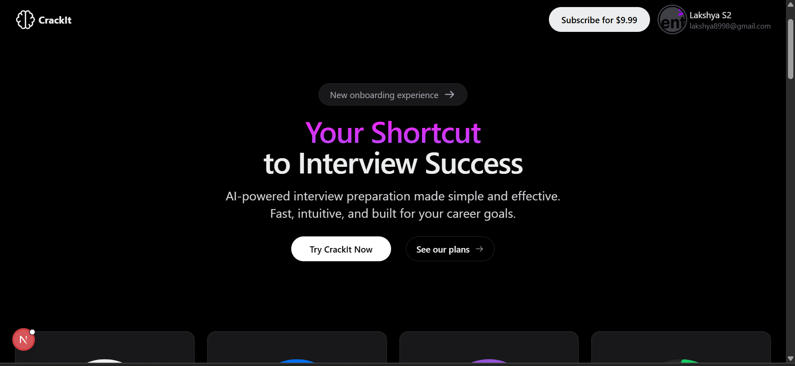
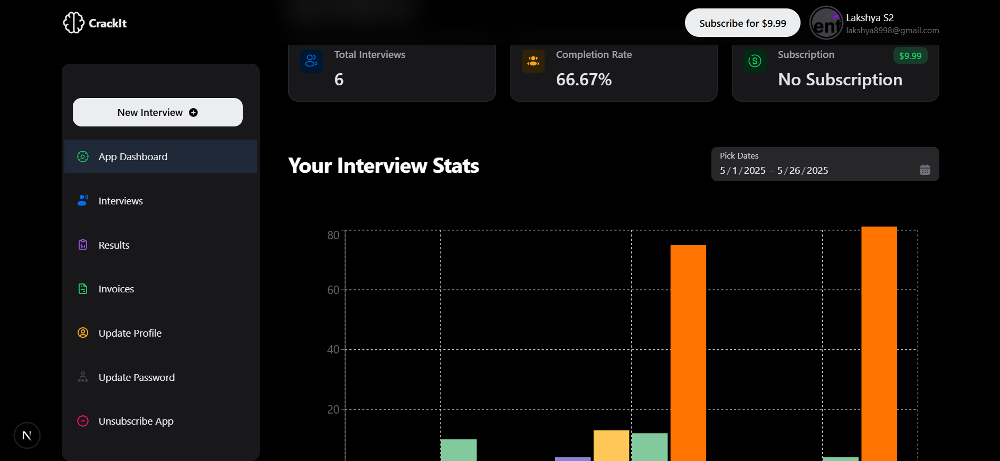
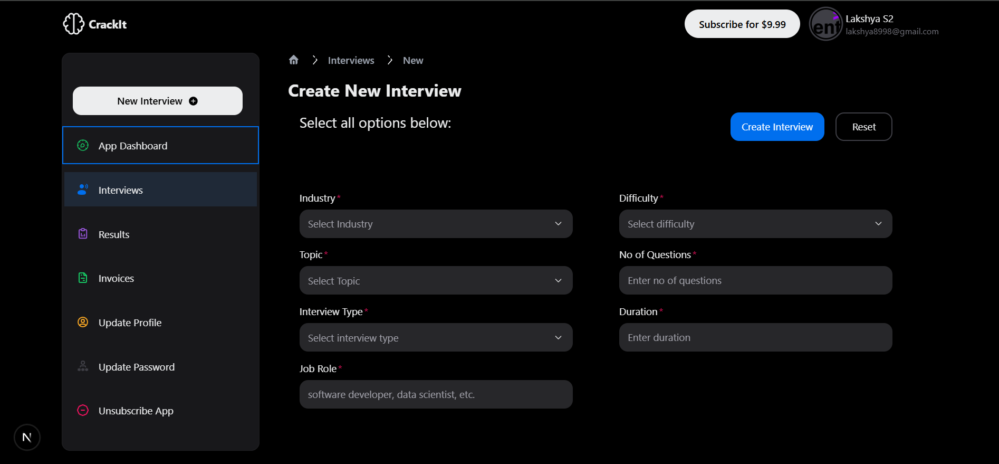
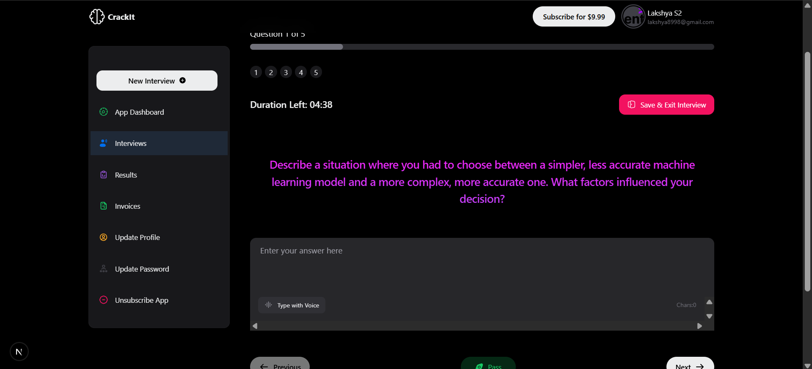

# CrackIt

CrackIt is a full-stack **Next.js** interview preparation platform with a sleek **HeroUI**-powered interface. It features secure OAuth authentication, Stripe subscriptions, Gemini AI-driven questions, role-based admin dashboards, and dynamic email notifications.

---

## 🚀 Features

- 🔐 **OAuth Authentication**  
  Google and GitHub login using **NextAuth.js** and **JWT**.

- 💳 **Stripe Payments**  
  Seamless subscription flow with Stripe API and webhook integration.

- 🤖 **Gemini AI Integration**  
  Dynamically generates personalized interview questions using Google's Gemini API.

- 🧑‍💼 **Admin Dashboard**  
  View user/subscription data, with role-based access control.

- 📚 **Interview Preparation**  
  Manage and practice interview questions stored in MongoDB.

- 📧 **Email Notifications**  
  Triggered emails for key user actions using **Nodemailer**.

- 🖥️ **Modern UI**  
  Built with **HeroUI**, **Tailwind CSS**, and **Next.js App Router**.

- 🔔 **Realtime Feedback**  
  Toast notifications via `react-hot-toast`.

---

## 🛠️ Tech Stack

**Frontend & Backend**  
- **Next.js** (App Router, Full-stack)
- **React + TypeScript**
- **Tailwind CSS**
- **HeroUI**

**Integrations**  
- **Authentication**: NextAuth.js + JWT  
- **Payments**: Stripe API  
- **Database**: MongoDB + Mongoose  
- **AI**: Gemini API  
- **Email**: Nodemailer  
- **Notifications**: react-hot-toast  

---

## 📸 Screenshots

### 🌐 Landing Page


### 📊 User Dashboard


### 📝 Create Interview


### ❓ Interview Questions


---

## 📦 Installation Guide

### Requirements
- Node.js (v18+)
- MongoDB (local or Atlas)

---

### 🔧 Setup

```bash
git clone https://github.com/<your-username>/CrackIt.git
cd CrackIt
npm install
# CrackIt

CrackIt is a full-stack **Next.js** interview preparation platform with a sleek **HeroUI**-powered interface. It features secure OAuth authentication, Stripe subscriptions, Gemini AI-driven questions, role-based admin dashboards, and dynamic email notifications.

---

## 🚀 Features

- 🔐 **OAuth Authentication**  
  Google and GitHub login using **NextAuth.js** and **JWT**.

- 💳 **Stripe Payments**  
  Seamless subscription flow with Stripe API and webhook integration.

- 🤖 **Gemini AI Integration**  
  Dynamically generates personalized interview questions using Google's Gemini API.

- 🧑‍💼 **Admin Dashboard**  
  View user/subscription data, with role-based access control.

- 📚 **Interview Preparation**  
  Manage and practice interview questions stored in MongoDB.

- 📧 **Email Notifications**  
  Triggered emails for key user actions using **Nodemailer**.

- 🖥️ **Modern UI**  
  Built with **HeroUI**, **Tailwind CSS**, and **Next.js App Router**.

- 🔔 **Realtime Feedback**  
  Toast notifications via `react-hot-toast`.

---

## 🛠️ Tech Stack

**Frontend & Backend**  
- **Next.js** (App Router, Full-stack)
- **React + TypeScript**
- **Tailwind CSS**
- **HeroUI**

**Integrations**  
- **Authentication**: NextAuth.js + JWT  
- **Payments**: Stripe API  
- **Database**: MongoDB + Mongoose  
- **AI**: Gemini API  
- **Email**: Nodemailer  
- **Notifications**: react-hot-toast  

---

## 📸 Screenshots

### 🌐 Landing Page


### 📊 Admin Dashboard


### 📝 Create Interview


### ❓ Interview Questions


---

## 📦 Installation Guide

### Requirements
- Node.js (v18+)
- MongoDB (local or Atlas)

---

### 🔧 Setup

```bash
git clone https://github.com/<your-username>/CrackIt.git
cd CrackIt
npm install

###▶️ Run the App
npm run dev

---

Open http://localhost:3000 in your browser.

🔐 Environment Variables
Create a .env.local in the root directory:


MONGODB_URI=mongodb://localhost:27017/crackit
NEXTAUTH_SECRET=your-next-auth-secret
NEXTAUTH_URL=http://localhost:3000

GOOGLE_CLIENT_ID=your-google-client-id
GOOGLE_CLIENT_SECRET=your-google-client-secret

GITHUB_CLIENT_ID=your-github-client-id
GITHUB_CLIENT_SECRET=your-github-client-secret

STRIPE_SECRET_KEY=sk_test_...
NEXT_PUBLIC_STRIPE_PUBLISHABLE_KEY=pk_test_...
STRIPE_WEBHOOK_SECRET=whsec_...

GEMINI_API_KEY=your-gemini-api-key
EMAIL_HOST=smtp.your-email.com
EMAIL_PORT=587
EMAIL_USER=you@example.com
EMAIL_PASS=your-email-password
